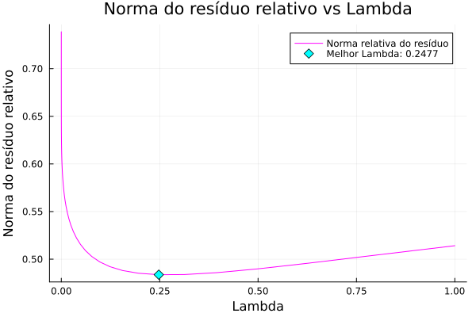
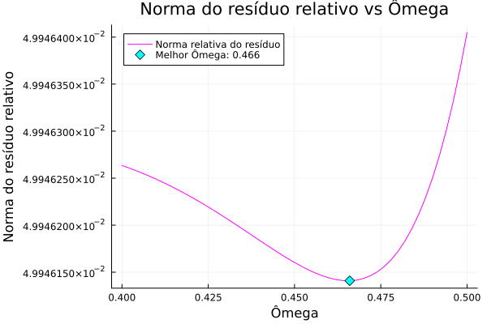
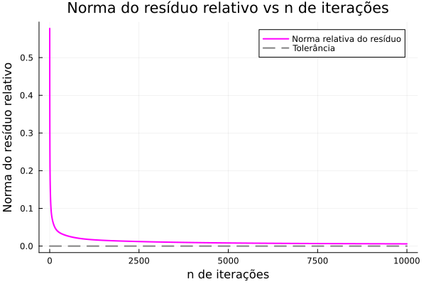
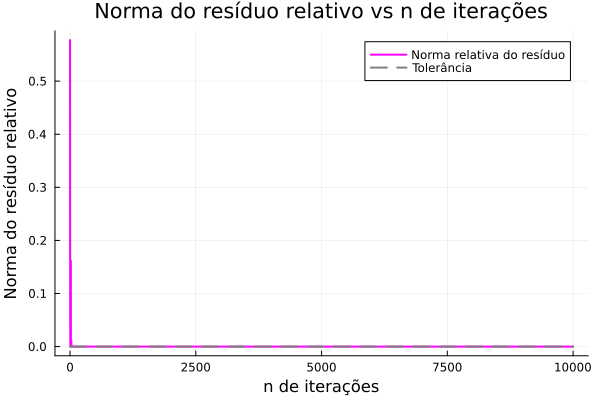

# hilbert-matrix
Various numerical analysis methods for solving a linear system of equations involving the Hilbert Matrix.

## The problem

Basically, we simply want to solve for $x$ the following system:

$$
Hx=b
$$

Where $H$ is the $n \times n$ Hilbert matrix given by the rule

$$
h_{ij} = \frac{1}{i + j - 1}
$$

And $b \in \mathbb{R}^{n}$ the vector given by 

$$
b = (1 \quad 1 \quad 1 \quad ... \quad 1)^{T}
$$

In this implementation, we will fix the order of $n$
to be 100.

The main metric used in this project is the **Relative residual norm** given by:

$$
    || r_{rel} || = \frac{|| b - Hx ||}{|| b ||} 
$$

## Methods

In this project, we implemented the following methods for aproximating the solution:

- LU decomposition
- Cholesky decomposition
- Jacobi Over-Relaxation (JOR)
- Successive Over-Relaxation (SOR)
- Gradient Ascent
- Conjugate Gradient

***All methods are implemented from scratch.***

## Results

### [LU decomposition](https://github.com/samuelkutz/hilbert-matrix/tree/main/src/LU)

Since LU is a relatively stable direct method for Symmetric Positive Definite (SDP) matrices, we can check the relative residual norm at each order $n$ compared to the desired tolerance

    

### [Cholesky decomposition](https://github.com/samuelkutz/hilbert-matrix/tree/main/src/Cholesky)

Overall, this is the best method for SDP matrices. However, due to the bad conditioning of $H$, the floating-point errors acumulate so much it looks like the $H$ decomposition lose its "positiveness" or something.

In order to prevent this, we can create a new aproximated matrix. We just need to add small values $\lambda$ to de diagonal of $H$ and see what reduces the relative residual norm the most:

    

### [JOR](https://github.com/samuelkutz/hilbert-matrix/tree/main/src/JOR)

Since $H$ is SDP, we can get the optimal $\omega$ in a closed form, but it does not work since, again, it is bad conditioned.

So we can simply iterate over various $\omega$ values and find the optimal one by brute force. 

    

### [SOR](https://github.com/samuelkutz/hilbert-matrix/tree/main/src/SOR)

Same thing as JOR, simply iterate over all possible $\omega$.

    

### [Gradient Ascent](https://github.com/samuelkutz/hilbert-matrix/tree/main/src/GradientAscent)

A really good family of methods are the iterative methods around the gradient. Deriving from optimization, the method converges really fast to an acceptable tolerance, but struggles to reach a good score. 

    

### [Conjugate Gradient](https://github.com/samuelkutz/hilbert-matrix/tree/main/src/ConjugateGradient)

 The theory AND the performace are INSANE, literaly SMASHED the other methods. In just 30 iterations it reached the desired tolerance of 1e-7. Absolute beast.

    

## References

- [Quarteroni Alfio. Numerical Methods, Texts in Applied Mathematics. Springer, 2007.](https://sites.math.washington.edu/~morrow/464_17/sacco%20saleri%20numerical.pdf)

-  [Hilbert David. “Ein Beitrag zur Theorie des Legendre’schen Polynoms”. In: Acta Math (1894).](https://projecteuclid.org/journals/acta-mathematica/volume-18/issue-none/Ein-Beitrag-zur-Theorie-des-Legendreschen-Polynoms/10.1007/BF02418278.full)
